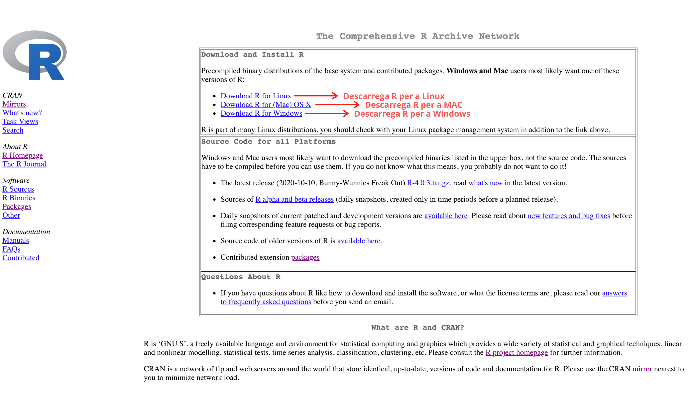
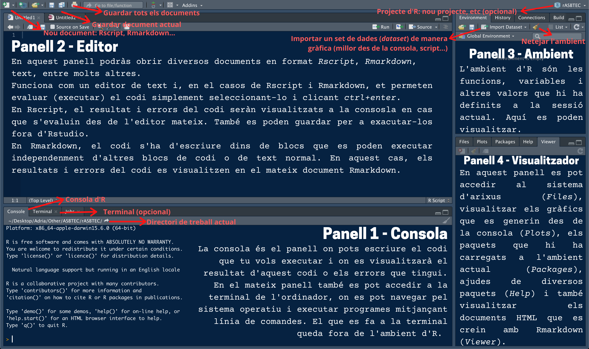
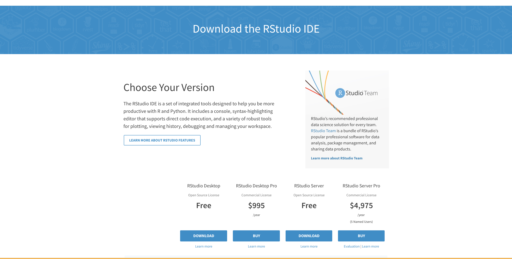

# Introducció

Aquesta unitat ens servirà d'introducció per a explicar què són R i RStudio, a més de donar una sèrie de passos per a la seva instal·lació.

## Què és R?

A diferència d'altres llenguatges com C o Java, R no és un llenguatge inicialment dissenyat per al desenvolupament de programari, encara que també ho permet, sinó que és un llenguatge estadístic dissenyat específicament per tal de dur a terme càlculs estadístics, dissenyar gràfics i realitzar anàlisis de dades. A més a més, R també proporciona l'entorn per a dur a terme totes aquestes computacions.

### Per què R?

#### Inconvenients

A diferència d'altres programes per a tractar dades estadístiques (ex. SPSS), R no té una interfície gràfica. Això significa que totes les operacions s'han de fer mitjançant ordres o comandes escrites (*commands* en anglès) mitjançant la consola. 

Tantmateix, això pot convertir-se en un avantatge ja que, al no tenir interfície gràfica, R és més ràpid en fer les anàlisis i és poc probable que es bloquegi utilitzant grans conjunts de dades, cosa que sí que pot passar amb altres programes.

#### Avantatges

Hem escollit R per una sèrie de motius:

* És **gratuït** i de **codi obert**. Això fa que la comunitat a internet sigui molt gran i interactiva, facilitant l'aprenentatge autodidacta.
* És **altament utilitzat** en les ciències biològiques, especialment en anàlisi de dades òmiques (transcriptòmica, cistròmica, ...), anàlisis de supervivència i tot tipus d'anàlisis que requereixin estadística.
* Permet tractar **grans conjunts de dades** de manera ràpida i eficient (molt més que amb Excel), així com visualitzar-los i analitzar-los.
* A més a més, igual que altres llenguatges, R permet guardar la feina feta en *scripts*, que no són res més que documents on hi ha tot el codi escrit i que poden ser executats de manera independent a la consola.

### Instal·la R

Per a instal·lar R al teu sistema operatiu, el més fàcil és anar a la web de la [CRAN](https://cran.r-project.org/) i descarregar-te els instal·ladors corresponents (veure la *Figura 1*) en la versió que volgueu. La versió recomanada per al curs és la 3.6.3, però la 4.0.3, que és la més actual, també ens servirà.

```{r fig.cap="Pàgina inicial de la CRAN (<i>Comprehensive R Archive Network</i>), on pots descarregar els instal·ladors d'R.", echo=FALSE}

```

Per a Windows:

* Un cop a la pàgina de la CRAN, cliqueu a _**Download R for Windows**_. 
* Aquí us demanarà quins instal·ladors us voleu descarregar. Heu de clicar a _**base**._
* Finalment, podreu descarregar-vos R en la versió més actual que, a dia d'avui, és la versió 4.0.3. Per a descarregar l'instal·lador, cliqueu _**Download R 4.0.3 for Windows**_ 
* En cas que volgueu una versió diferent, heu de clicar a _**Previous releases**_, triar la versió desitjada i seguir els mateixos passos.
* Una vegada l'instal·lador estigui descarregat, s'ha d'executar i seguir les instruccions.

Per a MAC OS X:

* Un cop a la pàgina de la CRAN, cliqueu a _**Download R for (Mac) OS X**_.
* Aquí us demanarà quina versió voleu instal·lar. A dia d'avui, la més actual és la 4.0.3, però podeu descarregar altres versións que es troben més avall.
* Cliqueu a l'enllaç per a descarregar la versió que volgueu (ex. *R-3.6.3.nn.pkg*).
* Executeu l'instal·lador i seguiu les instruccions.

Per a Linux:

* Un cop a la pàgina de la CRAN, cliqueu a _**Download R for Linux**_. 
* Escolliu la distro de Linux que utilitzeu (probablement Ubuntu).
* Seguir les intruccions.
* També podeu instal·lar R mitjançant la terminal i corrent la següent ordre: `sudo apt-get install r-base`.
* Des de l'*Ubuntu Software Center* també podeu descarregar R.

\newpage

## Què és RStudio?

RStudio és un entorn de desenvolupament integrat (*integrated developement environment*, **IDE**) per a R. En altres paraules, és una interfície gràfica que inclou una **consola** per a escriure les ordres, un **editor de text** que permet evaluar (executar) el codi i escriure els *scripts*, diverses eines per a la visualització de gràfics, un entorn de treball on es poden veure totes les variables definides, els paquets que s'han carregat, entre molts altres. 

Per altra banda, també permet crear documents en format *Rmarkdown*, que mescla *markdown* amb l'execució de codi en R, encara que també es pot executar codi en Python i Bash. Aquest format és molt útil per a crear informes en HTML o PDF que siguin fàcils d'entendre i que permetin visualitzar el codi utilitzat. De fet, tot aquest curs ha estat generat utilitzant aquest format. 

```{r fig.cap="Interfície gràfica d'RStudio amb una explicació dels quatre panells que té i d'algunes de les opcions que permet.", echo=FALSE}

```

### Instal·la RStudio

Per a instal·lar RStudio:

* Heu d'anar a la web del [projecte RStudio](https://rstudio.com/) i clicar a _**DOWNLOAD**_.
* Un cop aquí, heu de clicar a **_Download_** de *RStudio Desktop*.
* Si ja heu instal·lat R, podreu passar al punt 2 i descarregar RStudio pel vostre sistema operatiu (veure *Figura 3*).
* En cas que volgueu descarregar uns altres instal·ladors, més avall teniu l'apartat *All installers*, on podeu trobar tots els instal·ladors que necessiteu. 


```{r fig.cap="Pàgina web del projecte RStudio on podeu descarregar l'instal·lador que necessiteu.", echo=FALSE}

```

## Fes-ho tu!

Ara et toca a tu dur a terme tot el que has après en aquesta lliçó. Únicament has d'instal·lar R i RStudio 

## Recursos per a l'aprenentatge

1. The R Foundation. **The R project for statistical computing**. Online [aquí](https://www.r-project.org/).
2. RStudio. **RStudio website**. Online [aquí](https://rstudio.com/).
3. Rafael A. Irizarry. **Introduction to Data Science: Chapter 1**. Online [aquí](https://rafalab.github.io/dsbook/index.html).
