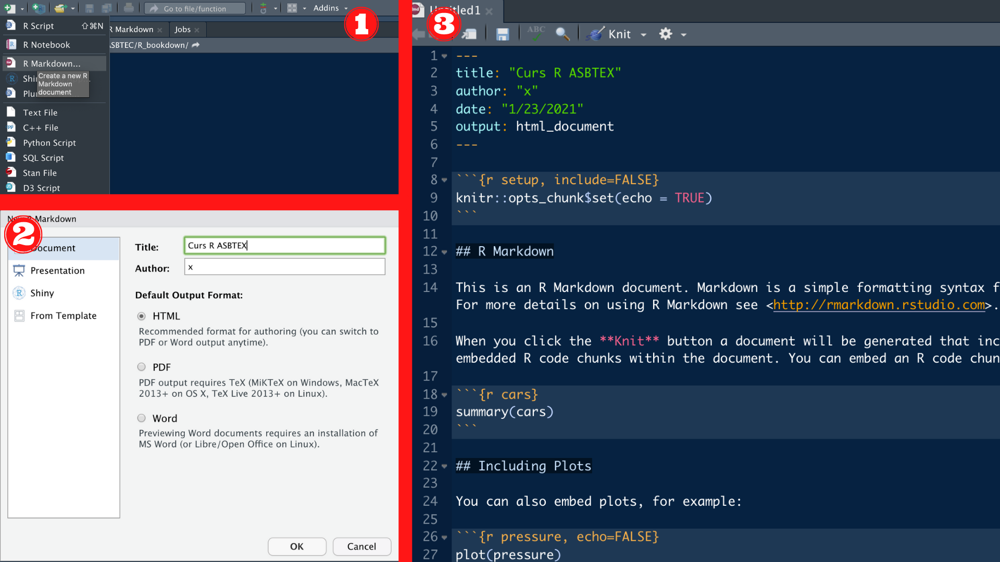
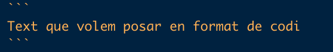
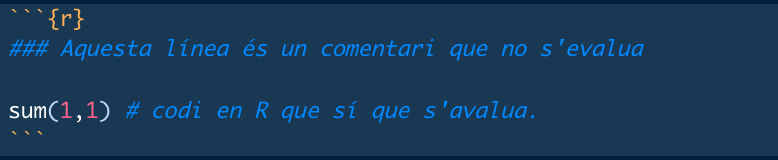

# Comencem

En aquesta unitat aprendrem:

* Conceptes bàsics d'R.
* Com configurar RStudio.
* Us bàsic d'R i Rmarkdown.

## Glossari bàsic

Abans de començar a utilitzar R i RStudio, s'han de conèixer alguns conceptes bàsics que us anirem mostrant al llarg del curs. Us deixem un petit glossari d'aquest conceptes.

* **Directori**: en poques paraules, sinònim de carpeta.
* **Ruta/camí (_path_)**: ruta a un fitxer o directori concret, que inclou tots els directoris anteriors i separats per una barra (**/**).
    + **_Path_ absolut**: ruta a un fitxer o directori que comença des del disc del sistema. Sol començar amb una barra **/** (ex. `/Users/ieo5089/Desktop/`).
    + **_Path_ relatiu**: ruta a un fitxer o directori que comença des d'una ubicació concreta on el sistema està ubicat actualment, anomenada directori de treball. No sol començar amb una barra (ex. des de `Desktop`, <code>Adria/Other/ASBTEC/cursos_R/imatges/logo_asbtec.png</code>).
    + Dins el _path_, podem indicar el directori actual amb un punt (**.**) o tirar enrere amb dos punts (**..**), sempre amb la separació la barra entre directoris (ex. des de `Desktop`, <code>./Adria/Other/ASBTEC/../../Other/ASBTEC/cursos_R/imatges/logo_asbtec.png</code>).
    + És recomanable no utilitzar espais en blanc o comes en el nom dels directoris o fitxers.
* **Directori de treball (_working directory_)**: directori on estem ubicats actualment i on R cercarà les dades. Per defecte, R agafa la carpeta de l'usuari (ex. `home`) com a tal. La carpeta `home` es pot especificar mitjançant **`~`** en un *path*.
* **Objecte**: qualsevol cosa emmagatzemada dins la memòria d'R, ja siguin variables, funcions, etc.
* **Variable**: dades que tenim emmagatzemades dins la memòria d'R, ja siguin un número, una paraula, un vector, una matriu de dades, etc.
* **Funció**: fragment de codi que tenim emmagatzemat dins un objecte dins la memòria d'R i que podem cridar repetidament, per exemple, la funció `sum()` que serveix per fer sumes dels nombres a l'interior del parèntesi. Algunes funcions tenen diversos paràmetres que podem canviar.
* **Paquets o llibreries**: conjunt de funcions, mètodes i sets de dades. Poden estar integrats dins R o poden haver estat desenvolupats per tercers. En el segon cas, s'hauran d'instal·lar i carregar dins de la sessió actual.
* **Entorn (o ambient) de treball (_environment_)**: entorn dins la memòria del sistema on es guarden totes les variables, paquets/llibreries, etc. Si volem utilitzar una funció, llibreria o variable, aquestes les hem de tenir definides dins l'entorn de treball. En cas contrari, R no les detectarà.
* *Evaluar codi*: significa executar un fragment de codi, ja sigui una ordre o diverses. En cas de *scripts* sencers, se sol parlar més d'executar o, a vegades, córrer. També podem dir que cridem una funció.
* **Comentari**: text utilitzat per explicar el codi però que no és evaluat. A R (també Python i altres), aquest text està precedit per un coixinet (**_#_**).

\newpage

## Comencem a fer servir R i RStudio

### Configurem RStudio

Ara que ja tenim R i RStudio instal·lats, només queda configurar-los al nostre gust i aprendre a utilitzar-los.

Cal mencionar que, a partir d'aquest punt, absolutament tot el que es dugui a terme en aquest curs es farà dins d'RStudio, tret dels casos que s'indiquin, així que el que hem de fer primer és obrir RStudio.

Per a configurar RStudio:

* **Apariència**: una de les coses que podem fer, és canviar els colors de RStudio. Com heu vist a la figura 2, els colors són foscos, mentre que, probablement, vosaltres els tindreu clars per defecte. Podeu canviar això:
  + A la barra superior, hem d'anar a *Tools*>*Global options*>*Appearance*
* **Distribució dels panells**: la distribució dels panells es pot canviar a la barra superior: *Tools*>*Global options*>*Pane Layout*

\newpage

### Com cridar funcions

Cridar una funció significa executar el codi que hi ha dins aquella funció i la podem cridar tantes vegades com volguem. 

Cal recordar que les funcions, així com la resta de codi, s'han d'evaluar dins la consola d'R, un *script* o un bloc de codi dins d'un document *RMarkdown* (dels quals en parlarem més endevant.)

Per a cridar una funció, simplement hem d'escriure el seu nom seguit de parèntesis (ex. `sum()`). 

A la majoria de les funcions, a dins el parèntesis hi ha el que se'n diuen *paràmetres* o *arguments*, que són valors o objectes d'R que se li donen a la funció com a *input*. En el cas de la funció `sum()` els arguments són els números que li donem perquè els sumi.

La funció `sum()` entre d'altres, son del paquet `base` d'R, que ja està integrat dins el mateix llenguatge, així com alguns altres paquets (ex. `stats`).

### Paquets externs

Per a cridar funcions de paquets externs, primer haurem de tenir instal·lat (més endevant s'explica com instal·lar paquets de diversos repositoris) el paquet corresponent. Després hem de **carregar** aquest paquet mitjançant la funció `library()` o `require()`. Aquest procés de carregar un paquet només és necessari fer-lo una vegada per sessió.

```{r eval = FALSE}
library(paquet) # carreguem el paquet que ens interessa
funcio()        # cridem la funció que es troba dins un dels paquets que hem carregat anteriorment
```

També podem fer cridar la funció indicant el nom del paquet al mateix temps mitjançant la següent estructura `paquet::funcio()`, tant si hem carregat el paquet amb anterioritat com si no. Aquest mètode té dos punts a favor molt clars:

* Evita errors en cas que tinguem dos paquets diferents que tenen dues funcions diferents però que es diuen igual, ja que una funció emmascara l'altra.

    + Per exemple, tenim un paquet anomenat `paquet1`, el qual té una funció anomenada `funcio()`, mentre que el paquet `paquet2` té una funció diferent amb el mateix nom i tenim els dos paquets carregats. Posem per cas que la funció del paquet `paquet1` té prioritat sobre la del paquet `paquet2`, però nosaltres volem utilitzar la del paquet `paquet2`, què hem de fer? Doncs simplement hem d'indicar de quin paquet volem fer servir la funció escribint el nom del paquet abans de la funció: `paquet2::funcio()`

```{r eval=FALSE}
library(paquet1)  # carreguem el paquet1
library(paquet2)  # carreguem el paquet2
funcio()          # cridem la funcio() del paquet1 perquè té prioritat
paquet2::funcio() # cridem la funcio() del paquet2 indicant el nom del paquet
```

* També permet cridar una funció sense carregar el paquet sencer, de manera que ens estalviem temps d'execució i memòria dins d'R.

A continuació, es mostra com instal·lar els paquets externs des de diversos repositoris.

#### CRAN

Hi ha moltes funcions que es troben a paquets desenvolupats per tercers que s'han d'instal·lar mitjançant la funció `install.packages("paquet")` en cas que es trobin al [CRAN](https://cran.r-project.org/). També podem instal·lar més d'un paquet a la vegada si posem els noms dins un vector. 

Per exemple, els paquets `dplyr`, `ggplot2` o `tidyverse`, paquets molt útils que utilitzarem més endevant.

```{r, eval=FALSE}
install.packages("dplyr") # instal·lem un paquet anomenat dplyr
install.packages(c("ggplot2", "tidyverse")) # instal·lem diversos paquets mitjançant un vector.
```

#### Bioconductor

Si treballem amb dades biològiques, és probable que la funció que desitgem utilitzar es trobi en un paquet dins del repositori [**Bioconductor**](https://bioconductor.org/), un repositori de paquets dedicats al tractament de dades biològiques, sobretot genòmiques. Per a instal·lar paquets que es troben dins de Bioconductor, primer necessitarem instal·lar el paquet `BiocManager` i utilitzar la funció `install()` dins d'aquest paquet. Una de les funcions que podem instal·lar és `GenomicRanges`, un paquet molt útil per tractar amb coordenades genòmiques.

```{r, eval=FALSE}
install.packages("BiocManager")       # instal·lem BiocManager
BiocManager::install("GenomicRanges") # cridem la funció install() per a instal·lar un paquet de bioconductor
```

Dins del paquet `BiocManager` hi ha altres funcions útils com la funció `available()` que ens permet obtenir una llista dels paquets disponibles per a poder instal·lar des de Bioconductor.

```{r}
BiocManager::available() %>% ## l'operador %>% és una 'pipe' del paquet 'dplyr'.
  head() ## la funcio head() serveix per a mostrar la part inicial de les dades.
```

#### Altres

A vegades, hi ha paquets que no estan a cap dels dos repositoris anteriors, ja sigui perquè es troben en desenvolupament o perquè l'autor ha preferit carregar-lo a una altra plataforma com, per exemple [GitHub](https://github.com/), un repositori de codi, el qual ara no entrarem a explicar.

De fet, hi ha moltíssims paquets interessants a GitHub. Alguns d'ells, com hem comentat, no es troben ni al CRAN ni a Bioconductor, mentre que d'altres sí que s'hi troben, però hi ha una versió en desenvolupament més nova que es troba a GitHub.

Així doncs, per a instal·lar un paquet des de GitHub haurem de fer servir una altra funció (n'hi ha de diferents). Encara que normalment, en el mateix repositori de GitHub ja es sol indicar la manera d'instal·lar el paquet, una de les funcions més utilitzades és la funció `install_github` del paquet `devtools` o del paquet `remotes`.

```{r eval=FALSE}
devtools::install_github("repositori")
remotes::install_github("repositori")
```

També hi ha altres llocs des d'on podem instal·lar paquets externs, com [BitBucket](https://bitbucket.org/) o [GitLab](https://gitlab.com/), que vindrien a ser el mateix que GitHub.

### Us bàsic d'R

Amb R podem fer multitud de coses. Aquí veurem una petita introducció d'alguns usos bàsics com operacions matemàtiques senzilles o estadística descriptiva... dels quals en parlarem amb més detall en capítols propers.

#### Definir variables {-}

Com hem dit, les variables són objectes d'R que emmagatzemen valors, vectors, etc.

Per a definir una variable a R, hem d'escriure el nom que li volem otorgar, seguida de `<-` o `=` i el valor o objecte que se li vol assignar (es recomana utilitzar `<-`, ja que `=` es pot confondre amb l'operador `==` que significa comparació).

A continuació definirem diverses variables i els assignarem diversos tipus de dades, dels quals en parlarem en detall al capítol 3.

```{r}
valor    <- 4
paraula  <- 'ASBTEC' # les paraules van entre cometes.
paraula  <- "ASBTEC significa Associació de Biotecnòlegs de Catalunya"
vertader <- TRUE
vertader <- T      # tant TRUE com T són el mateix (en majúscules)
fals     <- FALSE
fals     <- F      # tant FALSE com F són el mateix (en majúscules)


vector_num     <- c(10,10,34,67)     # un vector amb quatre valors 10, 10, 34, 67
vector_text    <- c("Hola, com estàs?", "Molt bé!")  # un vector amb elements de "text"
```

Aquestes variables es poden imprimir escribint el seu nom.

```{r}
valor
paraula
vertader
fals

vector_num
vector_text
```

Com podem veure, la variable `paraula` l'hem definit dues vegades i, en canvi, només ens apareix el segon valor que li hem assignat. Això és **perquè R llegeix el codi de dalt a baix** i, si volem dues variables diferents, no podem definir-les amb el mateix nom, ja que la segona sobrescriurà la primera. 

#### Càlculs senzills {-}

De les primeres coses que podem fer amb R és fer càlculs senzills com si es tractés d'una calculadora fent servir operadors matemàtics bàsics: 

* Suma: `+`
* Resta: `-`
* Multiplicació: `*`
* Divisió: `/`
* Potència: `**` o `^`.
* Mòdul: `%%`. El mòdul és el residu que queda en una divisió entre nombres enters.
* Divisió entera: `%/%`. La divisió entera retorna la part entera del resultat d'una divisió

```{r}
# Suma
9+2

# Resta
9-2

# Multiplicació
9*2

# Divisió
9/2

# Potència
9**2
9^2

# Mòdul
9.0 %% 2.0

# Divisió entera
9 %/% 2
```

També podem utilitzar diverses funcions bàsiques d'R per realitzar aquest càlculs i molts d'altres. Algunes funcions integrades a R:

* Suma: `sum()`
* Resta: `sum()` utilitzant nombres negatius
* Multiplicació: `prod()`
* Arrel quadrada: `sqrt()`
* Valor absolut: `abs()`
* Logaritmes: `log()`, `log10()`, `log2`
* ...

```{r}
# suma
sum(1,2,3,4)

# resta
sum(1,-2, 3)

# multiplicació
prod(1,2,3,4,5)

# arrel quadrada
sqrt(81)

# valor absolut
abs(-10)

# logarítmes
log(x = 100) # per defecte, la base de 'log()' és el nombre e, però es pot canviar
log(x = 100, base = 10) # logaritme en base 10
log10(100)              # logaritme en base 10
log2(4)                 # logartime en base 2
```

A més, si en comptes de números inserim vectors numèrics com argument, ens retorna el resultat per a tot aquell vector (dels vectors i altres estructures de dades ja en parlarem més endevant, també de matrius i marcs de dades).

```{r}
v <- c(1,2,3,4,5,6,7,8,9,10) #definim el vector i el guardem a l'objecte v

sum(v) # ens fa la suma de tots els valors dins el vector.

log10(v) # ens fa el logaritme de cada valor dins el vector
#...
```

Hi ha altres funcions que ens poden ajudar en molts sentits, encara que no són aquest tipus d'operacions poden ser:

* `round(x, digits)`: ens arrodoneix un número decimal o vector amb nombres decimals `x` a el número de decimals que li indiquem (`digits`), el qual pot ser 0.

* `ceiling(x)`: ens retorna el primer nombre enter més gran que el nombre decimal `x` que li indiquem.

* `trunc(x)`: ens tronca la part entera del nombre decimal `x` que li indiquem.
 
#### Estadística descriptiva {-}

Una de les altres coses que podem fer és estadística descriptiva molt bàsica. Algunes funcions integrades a R:

* Mitjana: `mean()`
* Mediana: `median()`
* Desviació estàndard: `sd()`
* Variança: `var()`
* Miním: `min()`
* Màxim: `max()`
* Quantils: `quantile()`
* Resum general: `summary()`
* ...

```{r}
v <- c(1,2,3,4,5,5,6,7,8,9,10) #definim el vector i el guardem a l'objecte v

mean(v)
median(v)
sd(v)
var(v)
min(v)
max(v)
quantile(v)
summary(v)

#...
```

#### Altres funcions {-}

Mitjançant algunes funcions d'R podem saber diverses informacions sobre el sistema:

* Informació general del sistema operatiu amb `Sys.info()`: nom, versió, ...

```{r}
Sys.info()
```

* Informació de la sessió d'R amb `sessionInfo()`: versió, plataforma, paquets carregats... Això és útil a l'hora de buscar errors, ja que moltes vegades els errors depenen en l'entorn (*environment*) de treball.

```{r}
sessionInfo()
```

* Data, hora, fus horari... amb `Sys.Date()`, `Sys.time()` i `Sys.timezone()`

```{r}
Sys.Date()      # data
Sys.time()      # data i hora
Sys.timezone()  # fus horari
```

### Establir un directori de treball

Per a **establir el directori de treball**, tenim dues opcions:

* A la barra superior, anar *Session*>*Set Working Directory* i triar l'opció que es vol:
  + *To Project Directory*: el directori en el que està definit el projecte. Aquesta opció només és útil si es té un projecte d'R obert, cosa que no és necessària, però que és útil en alguns casos.
  + *To Source File Location*: si treballem amb scripts o altres tipus de fitxers, aquesta opció ens establirà el directori de treball a la ubicació on hi hagi el fitxer guardat.
  + *To Files Pane Location*: la ubicació on tenim el panell de visualització en el moment d'activar aquesta opció.
  + *Choose Directory...*: aquesta és l'opció més senzilla ja que ens permet triar molt fàcilment la ubicació on volem establir el directori de treball.
* La funció `setwd()` i posant la ruta (entre cometes) al directori/carpeta on vols que R cerqui les dades. Aquesta opció és equivalent a l'última opció de l'apartat anterior. Per exemple:

  ```
  setwd("./Adria/Other/ASBTEC/cursos_R/")
  ```

El directori de treball es pot canviar sempre que es vulgui mitjançant qualsevol de les opcions anteriors.

En cas de crear o obrir un projecte d'R, el directori de treball s'establirà en el directori del projecte.

### Utilitzar *scripts* d'R

Com ja hem comentat amb anterioritat, un *script* d'R no és res més que un fitxer de text amb extensió `.R` que ens permet executar el codi d'R tant a la consola com independentment d'aquesta. A més també el podem utilitzar per a tenir una història de les ordres que hem executat i modificar-les de manera més simple per tal de corregir els errors que ens trobem.

Per a crear un *script* d'R, hem de clicar a la icona <i class="fa-file-medical"></i> de la part superior-esquerra de la pantalla i clicar a *R Script*. Un cop haguem fet això, ens apareixerà un nou fitxer (ex. *Untitled1*) en el qual podrem escriure tot el codi que volguem.

A més, també podem insertar comentaris mitjançant el coixinet (**_#_**). Les línies d'un *script* que comencin amb aquest caràcter no seran evaluades i ens permetran inserir text que ens ajudi a entendre el que el codi està fent, sobretot si hem de compartir aquest codi.

Un exemple de codi que podem posar dins un *script* és el següent:

```{r eval=FALSE, echo=TRUE}
# això és un comentari i no és executat.

setwd("~") # amb aquesta funció, canvio el directori de treball al meu 'home'.
getwd() # amb aquesta funció puc saber quin és el meu directori de treball actual.

# aquí podríem inserir més codi, carregar llibreries o definir funcions i variables
# però això ho deixearem per a més endevant
```

### Utilitzar documents Rmarkdown

`Rmarkdown` (`.Rmd`) és un format de fitxer que combina el format `R` i el format `markdown`. Això significa que podem crear un document amb extensió `.Rmd` que ens permetrà escriure tot el text que volguem mitjançant la sintaxis de `markdown` i, a més, inserir blocs de codi que funcionaran com *scripts* d'R que poden ser executats independentments els uns dels altres i que mostren el resultat dins el mateix doxument `Rmarkdown`. De manera opcional, també es poden utilitzar altres llenguatges, com `Python` i `Bash` dins de cada bloc de codi, però s'han tenir les dependències necessàries instal·lades i aquest curs no preveu ensenyar-les.

Finalment, també es poden convertir (o *renderitzar*) els documents `Rmarkdown` a HTML, PDF, Word i altres, cosa que fa que aquest format sigui molt útil per a fer informes (o per aquest curs). A continuació veurem l'ús bàsic dels Rmarkdown.

[Aquí](https://rstudio.com/wp-content/uploads/2016/03/rmarkdown-cheatsheet-2.0.pdf) teniu un petit resum (*Cheat sheet*) del funcionament d'`Rmarkdown`. A continuació us en fem una petita introducció.
 
Per a crear un document Rmarkdown:

```{r fig.cap="Passos per crear un document Rmarkdown: 1) iniciar la creació del document; 2) posar títol al document i crear-lo; 3) Rmarkdown per defecte i algunes de les seves característiques."}

```

* Clicar a la icona *del document amb el signe +* de la part superior-esquerra de la pantalla i clicar a *R Markdown*.
* Ens apareixerà una nova finestra on podrem posar el títol i autor del document Rmarkdown, així com el format del document que volem crear amb aquest Rmarkdown.
  
  + *Title*: títol del document Rmarkdown
    
  + *Author*: autor del document Rmarkdown
    
  + *Default Output Format*: format del document que voldrem crear a partir del document Rmarkdown. HTML és com una pàgina web, és dinàmica i fàcil d'entendre; per a crear un PDF necessitem LaTeX instal·lat.
  
* S'haurà creat un document per defecte, que ens dona unes petites instruccions i ens ajuda a entendre el funcionament dels documents Rmarkdown.
  
  + Al principi veureum una capçalera entre dos blocs de guions (`---`). Aquesta capçalera és on insertarem el títol (especificat en el pas 2), l'autor i la data (que són opcionals) i el format del fitxer a crear a partir del document Rmarkdown (és el que hem especificat al pas 2).
  + A la icona de *Knit* (a dalt), podem
  + A la icona *de l'engranatge * (a dalt) podem configurar algunes opcions del document Rmarkdown, així com les del document de sortida. Aquestes opcions del document de sortida també les podem indicar a la capçalera, per exemple:
  
  ```
  output:
    html_document:        # indiquem que volem un document HTML
      toc: yes            # indiquem que volem un índex (toc = 'table of contents')
      toc_float: yes      # indiquem que volem que l'índex sigui flotant  
      toc_depth: 3        # l'índex tindrà els títols fins a dos subtítols (títol, subtítol, subsubtítol)
      code_folding: hide  # indiquem que volem que s'amagui tot el codi.
  ```
  
  + En el document Rmarkdown que es crea per defecte veurem un bloc de codi d'R entre dos blocs de 3 accents oberts  i, entre claus, una `r` , un títol `setup` i unes opcions `include = FALSE`. La lletra `r` indica que el codi que escrivim ha de ser evaluat com a codi d'R (també podríem posar `python`, `bash` o res, en cas que no volguessim evaluar el codi però volguéssim indicar que es tracta de codi); el títol no és necessari, però és recomanable; les opcions són molt útils, `include = FALSE` significa que no volem incloure el bloc (ni els resultats d'aquest) al document final, però sí que volem executar el codi.
  
  + El primer bloc de codi (`setup`) és important perquè ens estableix opcions per a tots els blocs de codi i no és recomanable esborrar-lo. Per defecte ens apareix `echo = TRUE`, que significa que volem que es mostrin els blocs de codi. Podeu trobar una llista més completa d'aquetes opcions pels blocs (*chunk options*) en el següent enllaç: <https://yihui.org/knitr/options/>.

#### Sintaxi de markdown {-}

El text en format `markdown` és tot aquell text que no estigui dins de blocs de codi i que, per tant, no serà evaluat com a tal. És similar al format de text dels documents *.txt* però amb més opcions de format (títols, negreta, cursiva...).

Comencem amb la sintaxi de `markdown`. A continuació teniu algunes instruccions, encara que també podeu mirar la [*cheat sheet* de Rmarkdown](https://rstudio.com/wp-content/uploads/2016/03/rmarkdown-cheatsheet-2.0.pdf):

* **Títols/capçaleres (_headers_)**: per als títols de cada apartat útilitarem els coixinets (ex. `# Apartat 1`) i per a cada subapartat afegirem un coixinet més (ex. `## Subapartat 1.1`, `### Subapartat 1.1.1`, ...).

* **Text**: el text normal l'escriurem com si es tractés d'un document de text.

* **Cursiva**: el text en cursiva ha de tenir un asterisc (ex. `*cursiva*` --> *cursiva*) o guió baix. (ex. `_cursiva_` --> *cursiva*) a cada banda. 

* **Negreta**: el text en negreta ha de tenir dos asteriscos (ex. `**negreta**` --> *negreta*) o guions baixos. (ex. `__negreta__` --> *cursiva*) a cada banda. 

* **Subíndex**: els subíndex els hem d'escriure amb `~` (ex. `~subíndex~`--> ~subíndex~) a cada banda.

* **Superíndex**: els superíndex els hem d'escriure amb `^` (ex. `^superíndex^`--> ^superíndex^) a cada banda.
* **Text ratllat**: per a fer text ratllat, hem d'escriure `~~` a cada costat.

* **Text en format codi**: el text amb font de codi (*Verbatim*) l'hem d'escriure amb un accent obert (\`) a cada banda en cas que volguéssim escriure dins la mateixa línea de text o entre  blocs de tres accents oberts (\`\`\`) en cas que volguessim fer un bloc de codi.

  

* **Codi en R**: a Rmarkdown podem escriure codi en R dins de la mateixa línia com codi normal però amb una **r** derrere el primer \` o en un bloc a part, mitjançant els tres accents:

  

* **Hipervincles**: per a inserir hipervincles hem d'escriure la paraula que farà de vincle entre claudàtors `[]` seguida de la ruta/*path* (URL o *path* al fitxer dins el sistema) entre parèntesis `()` (ex. `[ASBTEC](https://asbtec.org)` --> [ASBTEC](https://asbtec.org)).

* **Imatges**: per a inserir imatges (JPEG, PNG...) hem de fer servir la mateixa sintàxi que amb els hipervincles, però amb un signe d'exclamació `!` a davant (``):

  ``
  
  
  *Per a inserir imatges també podem fer-ho mitjançant algunes funcions d'R com `knitr::include_graphics()`*

* **Línies horitzontals (_hrules_)**: Per a fer línies horitzontals hem de fer servir `---`, `***` o `___`. Per exemple:

  ---
  
* **Equacions**: per escriure en text en format d'equació, hem d'utilitzar els blocs de `$` per a fer-ho en una mateixa línea o `$$` per a fer un bloc separat i utilitzar llenguatge de làtex. També podem fer servir lletres gregues i tot tipus d'operadors matemàtics: [aquí](https://rpruim.github.io/s341/S19/from-class/MathinRmd.html) teniu una llista amb tot tipus d'equacions. Per exemple: 

    + `$A = \pi * r^2$` -->  $A = \pi * r^2$
    
    + I utilitzant `$$`, per exemple, la següent funció `$$\sum_{i=1}^{k} x_{i}$$` dona lloc a $$\sum_{i=1}^{k} x_{i}$$
  
* **Llistes**: a markdown es poden fer diversos tipus de llistes: ordenades (numèriques) i no ordenades. 

  + **Llistes no ordenades**: per a fer una llista no ordenada farem servir l'asterisc `*` al principi de cada objecte de la llista. Per exemple:
  
  ```
  * Objecte 1
  ```

  + **Llistes ordenades**: per a fer llistes ordenades ho podem fer amb números, simplement indicant `1.`, `2.`... al principi de cada objecte de la llista, per exemple: 
  
  ```
  1. Objecte 1
  2. Objecte 2
  ```

 + **Subllistes**: per a fer llistes dins una altra llista, hem de posar una identació (tabulació o quatre espais) i utilitzar `+` al principi de cada element de la subllista. Per exemple:

  ```
  * element 1:
  
    + element 1.1
    + element 1.2
  ```
  
* *Taules*: amb *Markdown* també podem fer taules (treballem amb *RMarkdown* també les podem fer creant una matriu o *data frame* amb R i imprimint-lo al mateix document). Per a construir la taula, només hem d'utilitzar guions (`-`) com a línees horiziontals per a separar el títol de les columnes, barres verticals (`|`) com a línees verticals per a fer les columnes i dos punts (`:`) per a alinear el text. Per exemple:

  ```
  | Per defecte | Alineació a la dreta | Alineació a l'esquerra | Centrat |
  | ----------- | -------------------: | :--------------------- | :-----: | 
  | ASBTEC      | No cal mantenir l'alineació de les barres verticals per a poder fer la taula, encara que és desitjable per tal de fer el document més llegible | Esquerra  | Mig
  | 13.466      | Biotecnologia        | Inicia't a R           | 2021    |
  ```
  
  | Per defecte | Alineació a la dreta | Alineació a l'esquerra | Centrat |
  | ----------- | -------------------: | :--------------------- | :-----: | 
  | ASBTEC      | No cal mantenir l'alineació de les barres verticals per a poder fer la taula  encara que és desitjable per tal de fer el document més llegible | Esquerra  | Mig
  | 13.466      | Biotecnologia        | Inicia't a R           | 2021    |


Hi ha moltes més coses que es poden fer amb *Markdown* i *R Markdown*, però aquí només us n'hem fet una petita introducció.

 
#### Altres llenguatges {-}

A part de la sintàxis específica (mirar [*cheat sheet* d'Rmarkdown](https://rstudio.com/wp-content/uploads/2016/03/rmarkdown-cheatsheet-2.0.pdf)), dins un document *Rmarkdown* podem utilitzar llenguatge **LaTeX**, en cas que volguem convertir el document en PDF, i **HTML** en cas que volguem convertir el document a HTML, entre d'altres. 

També podem utilitzar (i crear) plantilles de *LaTeX*, *pandoc*... i així obtindrem un document més organitzat.

En aquest curs no s'ensenyarà res d'això, però si voleu aprendre'n més, podeu fer un cop d'ull a [aquest llibre](https://bookdown.org/yihui/rmarkdown/).


### Crear un projecte d'R

En alguns casos pot ser molt útil crear un projecte d'R en comptes de treballar sense projecte. En cas de principiants no és necessari, però crear un projecte d'R ens pot ser molt útil per a:

* Tenir tot el codi i els fitxers relacionat amb un projecte en una mateixa ubicació.
* Poder controlar i compartir el vostre codi més fàcilment mitjançant repositoris de *git*. Aquesta opció és més avançada.
* Per a quan volguem fer pàgines web (encara que siguin locals).
* ...

Per a crear un nou projecte d'R (*Rproject*), s'han de seguir els passos esmentats a continuació:

1. Clicar al botó de la part superior-dreta on hi diu *Project* i clicar a *New Project*. En cas de tenir un projecte obert, en comptes de *Project*, a la part superior-dreta hi hagi el nom del projecte en qüestió.
2. Si RStudio ens demana de guardar alguns fitxers, indicar si volem guardar-los o no i clicar a *Don't Save* o *Save*/*Save Selected*.
3. Escollir si volem crear un nou directori pel projecte o si el volem posar a un directori ja existent. És recomanable crear nou directori.
4. Segons els paquets i llibreries que tinguem instal·lats, ens apareixaran diversos tipus de projectes per a crear. El que apareix sempre és *New Project* que ve a ser el projecte normal.
5. Indicar del directori que contindrà el projecte del i i la ubicació d'aquest directori. Opcionalment, podeu indicar si en el projecte voleu crear un repositori de git (*GitHub*, *GitLab* o *BitBucket*), però aquesta opció no és recomanable per aquelles persones que no estiguin habituades a utilitzar git.
6. Finalment, veureu com RStudio us crea un nou directori amb diversos fitxers a dins. El tipus de projecte que hem indicat al punt 4 (*New Project*), ens generarà un fitxer `nom_projecte.Rproj` on `nom_projecte` és el nom que li hem donat al nostre projecte. Altres tipus de projectes ens poden altres fitxers i carpetes, però no en parlarem en aquest capítol.

Sempre que creeu un nou projecte o l'obriu mitjançant el fitxer `nom_projecte.Rproj`, aquest us apareixerà a una llista de projectes dins el menú *Project* que hem comentat al pas 1, de manera que podeu accedir a diversos projectes de manera molt ràpida i, fins i tot, obrir-los a sessions d'RStudio (per tant, entorns de treball) independents. 

## Exercicis.

### Exercici 1 {-}

**a) Obre RStudio i crea un projecte anomenat `curs_R_asbtec` en un nou directori. D'aquesta manera podràs accedir fàcilment al curs cada vegada que obris RStudio.**

**b) Crea un _script_ d'R o un document _Rmd_ i guarda'l com a `curs_asbtec.R` (probablement sigui més útil un _Rmd_). D'aquesta manera podràs guardar els apunts/exercicis que facis en el curs (pots fer-ne un de sol per a tot el curs o diversos per a cada capítol, i separar apunts i exercicis o fer-ho tot junt).**

**c) Insereix un comentari (en el cas de l'_script_) o un títol (en el cas del document _Rmd_) amb `#` indicant el títol del curs, i els subtítols conseqüents (`##`...) indicant els títols dels capítols, etc.**

<p style="font-size:10px"> **Nota de l'exerici 1: els següents exercicis els pots fer dins el document creat en aquest exercici 1**</p>

### Exercici 2 {-}

**Defineix una variable `hola` a la qual assignaràs la salutació 'Hola, món!'. Després imprimeix aquesta variable**

### Exercici 3 {-}

**Escriu les funcions corresponents i instal·la els paquets seguents (la majoria es troben al CRAN, encara que algun d'ells es troba a Biocondctor):**

* `BiocManager`: per a instal·lar paquets de Bioconductor. ^*obligatori^
* `rmarkdown`: ens permetrà utilitzar algunes funcions dels documents RMarkdown. ^*obligatori^
* `dplyr`: molt útil per a tractar dades i modificar taules. També accessible instal·lant el paquet `tidyverse`. ^*obligatori^
* `ggplot2`: molt útil per a visualitzar dades i fer gràfics. També accessible instal·lant el paquet `tidyverse`. ^*obligatori^
* `GenomicRanges`: molt útil per a tractar amb coordenades genòmiques.
* `Biostrings`: molt útil per a tractar amb seqüències d'ADN, ARN, proteïnes...


<p style="font-size:10px"> **Nota de l'exerici 3: és possible que us apareixin preguntes a la consola com:** </p>
<p style="font-size:10px">`Update all/some/none? [a/s/n]`: aquesta pregunta significa si voleu actualitzar paquets ja instal·lats (`a` = all, `s` = some, `n`= none).</p>
<p style="font-size:10px"> `Do you want to install from sources the packages which need compilation? (Yes/no/cancel)`: aquesta pregunta és per instal·lar paquets en els quals depèn el paquet que voleu instal·lar i que necessiten compilació. En teoria no us hauria d'apareixer, però si us apareix i no teniu el programari requerit per a compilar, pregunteu o no instal·leu el paquet en qüestió.</p>


### Exercici 4 {-}

**a) Juga amb els operadors matemàtics (ex. `+`,`-`).**

**b) Juga amb les funcions d'operacions matemàtiques (ex. `sum()`...).**
**c) Juga amb les funcions d'estadística descriptiva (ex. `mean()`...).**

### Exercici 5 {-}

**Utilitza la següent línia de codi `v <- c(1,2,3,4,5,6,7,8,9,10)` per a definir el vector `v` i fes el mateix que a l'exercici 4, però amb el vector `v`.**


## Recursos per a l'aprenentatge

1. Rafael A. Irizarry. **Introduction to Data Science: Chapter 1**. Online [aquí](https://rafalab.github.io/dsbook/index.html).
2. RStudio. **Rmarkdown cheat sheet**. Online [aquí](https://rstudio.com/wp-content/uploads/2016/03/rmarkdown-cheatsheet-2.0.pdf).
3. Yihui Xie, J. J. Allaire, Garrett Grolemund **R Markdown: The Definitive Guide**. Online [aquí](https://bookdown.org/yihui/rmarkdown/).
4. Randall Pruim. **Mathematics in R Markdown**. Online [aquí](https://rpruim.github.io/s341/S19/from-class/MathinRmd.html)
