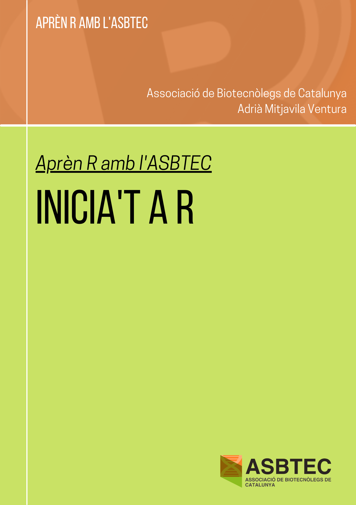

--- 
title: "Cursos ASBTEC | Inicia't a R"
cover-image: "assets/portada.png"
site: bookdown::bookdown_site
output:
  bookdown::gitbook
documentclass: book
bibliography: [book.bib, packages.bib]
biblio-style: apalike
link-citations: yes
description: ""
---

# {-}

```{r fig.align='center', echo=FALSE}

```

# Edició {-}

Acutalment, el curs *Inicia't a R* de l'Associació de Biotecnòlegs de Catalunya es troba en la primera edició.

* 1a edició [2021]. Responsable(s): [Adrià Mitjavila](amitjavilaventura.github.io) 

# Llicència {-}

<a rel="license" href="http://creativecommons.org/licenses/by-nc-nd/4.0/"></a><br />Aquest treball està protegit sota la llicència <a rel="license" href="http://creativecommons.org/licenses/by-nc-nd/4.0/">Creative Commons Attribution-NonCommercial-NoDerivatives 4.0 International License</a>, per la qual es pot compartir el material per a usos no comercials i amb les condicions d'atribució a l'autor i de no modificació.

# Pròleg {-}

## Objectius del curs {-}

Aquest curs, íntegrament en català, ha estat dissenyat per membres de l'ASBTEC per al benefici dels socis de l'associació.

D'aquesta manera pretenem que els alumnes que el duguin a terme aprenguin a fer servir R des de zero i sense cap coneixement d'informàtica més enllà dels que té l'usuari mig.

Els coneixements que es volen impartir estan relacionats amb el funcionament bàsic d'R, la transformació i visualització de dades i, per acabar, com utilitzar R per al tractament de dades biològiques.

Els materials proporcionats permetran assolir els objectius pel que fa als coneixements bàsics. Tantmateix, es proporcionaran diversos recursos web i bibliografia que es poden trobar fàcilment amb una cerca ràpida per internet i que poden ajudar als alumnes del curs a aprofundir en l'aprenentatge.

## Continguts del curs {-}

Aquests cursos pretenen donar a conèixer el funcionament bàsic d'R per a poder fer informes, tractar i visualitzad dades, etc. Els coneixements que volem transmetre són:

* Què són R i RStudio?
* Comença a utilitzar R i RStudio.
* Tipus i estructures de dades a R.
* Bucles `for`, `while` i estructures condicionals `if`/`else`.
* Funcions a R: més a fons.
* Tractament i visualització de dades amb els paquets integrats a R.
* Tractament i visualització de dades amb els `dplyr`, `ggplot2` i altres paquets.
* ...

Més endevant, farem un curs d'anàlisis de dades biològiques amb R.

D'altra banda, si a algú li interessa aprendre altres temes relacionats amb R, pot demanar-nos-ho i valorarem la inclusió de nous temes dins d'aquest curs. 
